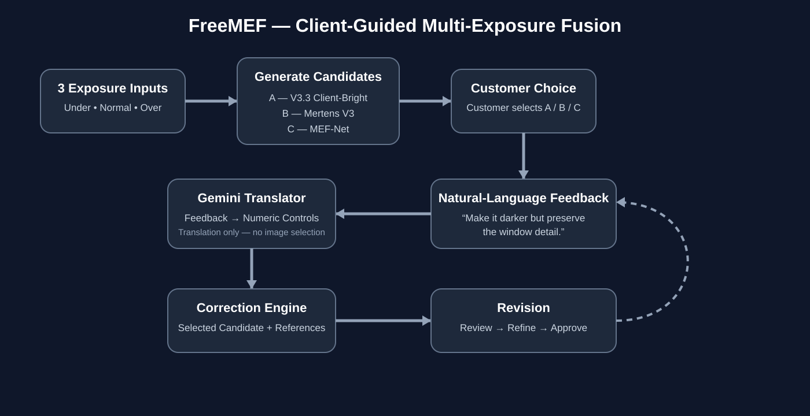

<div align="center">


# FreeMEF

### Client-Guided Multi-Exposure Image Fusion

**Three exposures → Three fusion candidates → Customer choice → AI-assisted refinement → Final image**

<br>


</div>

---

## Overview

**FreeMEF** is a client-guided multi-exposure image fusion system designed to produce natural-looking images from three exposures of the same scene.

Instead of automatically deciding which fusion result is best, FreeMEF generates **three different fusion candidates** and allows the **customer to choose the preferred result**.

After the customer makes a choice, they can describe the required changes using natural language. Gemini translates that feedback into controlled numerical parameters, and the correction engine creates a new revision using the original exposure images as references.

The system is designed to preserve the visual character of the normal exposure while recovering useful highlight information from the under exposure and shadow information from the over exposure.

---

## Visual Workflow



---

## How It Works

FreeMEF uses three exposures of the same scene:

| Exposure | Main Role |
|---|---|
| **Under** | Helps recover bright areas, windows, and highlight detail |
| **Normal** | Main visual anchor for brightness, color, white balance, depth, and overall appearance |
| **Over** | Helps recover darker regions and shadow detail |

For every uploaded scene, the system generates three candidates **at runtime**.

### Candidate A — FreeMEF V3.3 Client-Bright

A custom adaptive fusion pipeline designed around the normal exposure while selectively using additional information from the under and over exposures.

### Candidate B — Mertens V3

An improved Mertens exposure-fusion pipeline with emphasis on normal-exposure preservation, highlight protection, shadow handling, and image detail.

### Candidate C — MEF-Net

A neural multi-exposure fusion pipeline integrated into the FreeMEF candidate-generation workflow.

### Customer Selection

All three candidates are shown to the customer:

```text
Candidate A      Candidate B      Candidate C
      \                |                /
       \               |               /
        └──── Customer reviews all three ────┘
                         |
                         ↓
                  Customer chooses A/B/C
